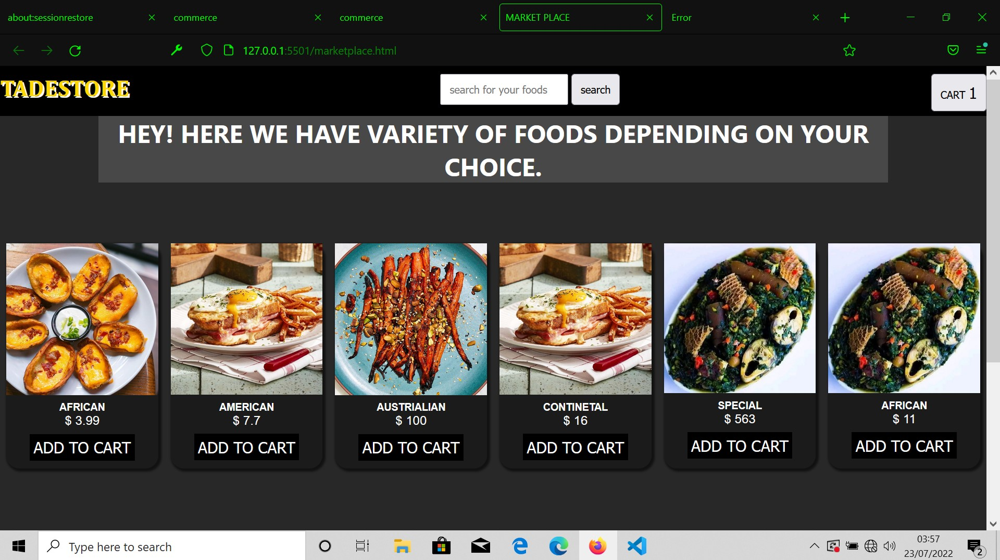
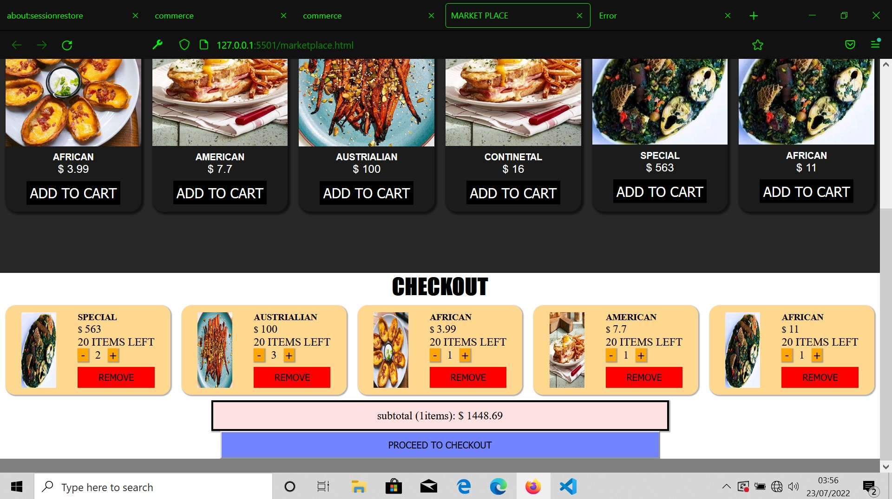
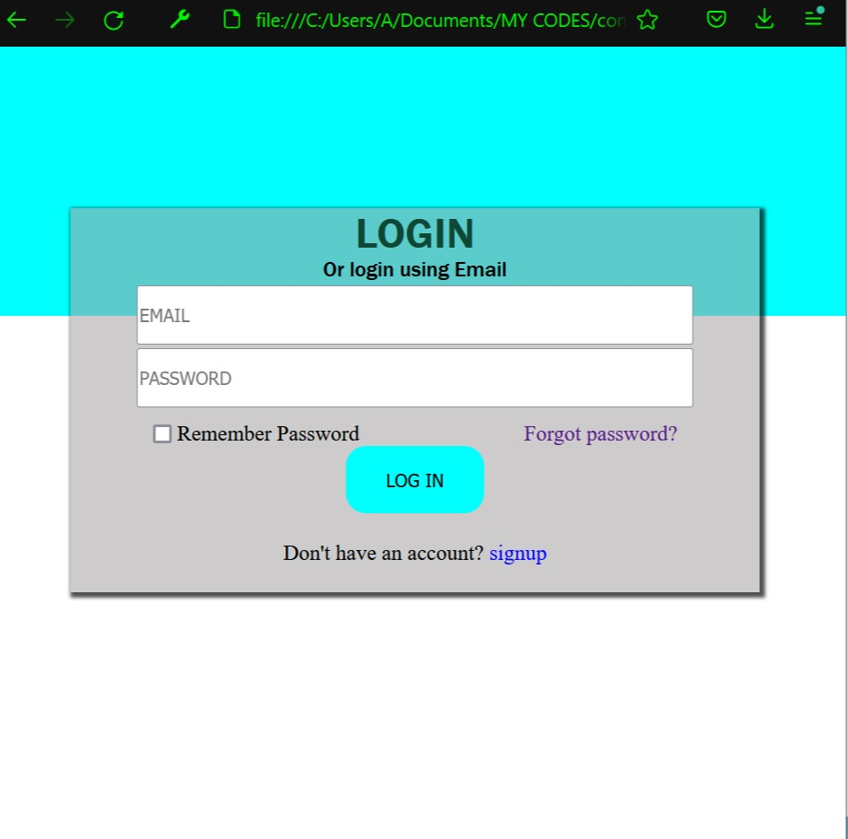
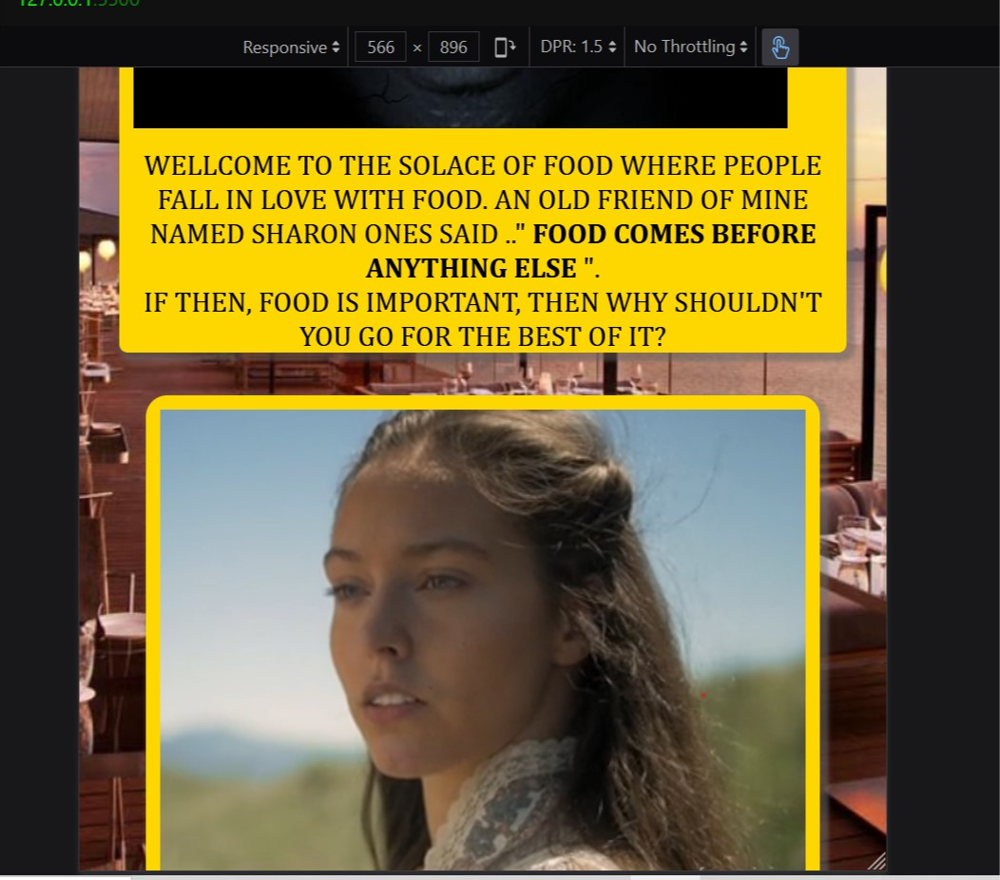

# FOOD STORE/ ONLINE RESTUARANT
##FOR THE LIVE LINK CHECK NAVINGATING THE SITE. PLS READ CAREFULLY.

AS TECHNOLOGY IS FAST REPLACING THE CONVENTIONAL WAY OF DOING THINGS, THE NEED FOR HAVING A TECHNOLOGY ORIENTED DEVELOPMENT TO FOOD / RESTURANT / LEAVING YOUR COMFORT ZONE SHOULD EVOLVE PAST THAT.
# THE WEBSITE OVERVIEW
IT WAS BUILT WITH VANILLA CSS AND VANILLA JAVASCRIPT. SINCE THERE IS NO BACKENED/ DATABASE, TWO DATABASE WERE ARTIFICAILLY CREATED (FOR HE PRODUCTS AND FOR THE USER LOGIN PAGE). FOR BUGS OR RELATED ISSUES, YOU CAN GIVE A FEEDBACK. THE WEBSITE HAS BEEN DEVELOPED.
# NAVIGATING THE SITE
HOME PAGE(INDEX.HTML) => LOGIN(LOGIN.HTML) => DISHES(MARKETPLACE.HTML)
 https://dearbornadeolu.github.io/SHOPPING-SITE/
# LOGIN PAGE
THE LOGIN PAGE WOULD ASK FOR TWO INPUTS
IF YOU'VE NEVER REGISTERED, IT MIGHT REDIRECT YOU TO THE SIGNUP PAGE. 
# MARKET/ SHOPPING STORE
TO NAV BACK, GO TO THE BASE OF THE WEBSITE.
# POSSIBLE PROBLEMS 
IF YOU ENCOUNTER ANY PROBLEM, FEEL FREE TO DROP YOUR FEEDBACK
# SOME SNIPPETS

